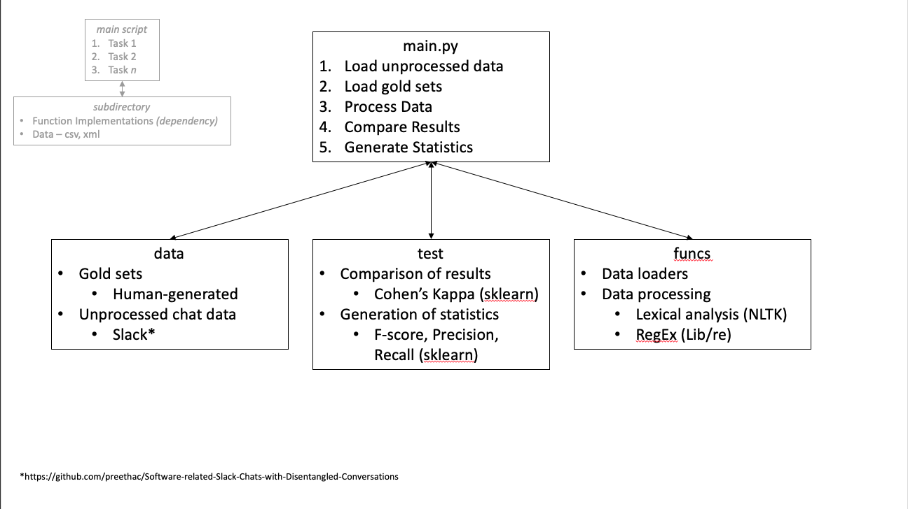

# CISC367
Repository for my CISC 367 work.

Code used for homework 5 is pulled from a pair of open-source repositories. The function used to open XML files is pulled from https://github.com/JacksonBurns/Crow
(licensed under the AGPL-3.0) and the function used for seraching a set of data for a regular expression if adapated from https://github.com/himaghna/computational-chemistry-toolbox

## Semester Project
Contained under the **Project** directory is the work completed for the semseter research project. Contributions are as indicated by the commit history.

### Repository UML Layout 

General visualisation of the project's workflow. 

### data
The ***Data*** directory contains the raw data sets used for this project as XML files as well as all gold sets used for comparison as CVS files. Data for this project was collected from public Slack channels. 

### funcs
The ***funcs*** directory holds the main scripts of the project. This includes scripts to parse XML files, remove unwanted characters, and finally determine if a sentence is an unpuncuated question.

### test
The ***test*** directory is used to calculated both the F-score and Cohen's Kappa of the results of the main scripts when compared against the gold sets. 
